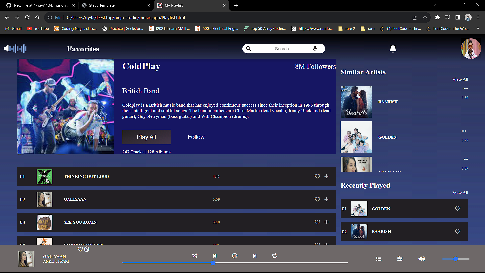

# Music App

## Site Hosted
[Link](https://ravi1104.github.io/music_app/)

## Overview
This Music App project is designed to provide a simple yet functional music playback experience. It includes a main page and a playlist page, all built using HTML, CSS, and a touch of JavaScript.

## Features
- Play and Pause Buttons: Easily control music playback with these intuitive buttons.

## Pages
### Main Page
- This is the landing page of the app.
- Provides a clean and user-friendly interface.
- Play and Pause buttons for music playback control.

### Playlist Page
- Access your music playlists here.
- Explore your favorite tracks and artists.

## Technologies Used
- HTML: For structuring the web pages.
- CSS: For styling and layout.
- JavaScript: For interactivity and music playback.

## How to Run
1. Clone this repository to your local machine.
2. Open the `index.html` file to access the main page.
3. Navigate to the `playlist.html` file for accessing the playlist page.

## Screenshots

## Acknowledgments
- All images used are from Google search; none of them belongs to me.

Feel free to enhance and customize this Music App as per your preferences. Enjoy your music!
